# **Web Stack Implementation (LEMP Stack)**

## **What is a LEMP Stack**

A LEMP stack is a powerful combination of software components that collectively form a robust platform for developing and hosting dynamic websites and web applications. The term "LEMP" is an acronym representing the four essential components constituting the stack: Linux, Nginx (pronounced "Engine X"), MySQL, and PHP.

## **Overview of each component of the LEMP Stack**

#### *Linux*
At the foundation of the LEMP stack lies Linux, the operating system that provides the necessary infrastructure for running the other components while efficiently managing hardware resources.

#### *Nginx*
Nginx, an open-source web server software, plays a crucial role in the LEMP stack. It listens to incoming HTTP requests from clients, processes these requests, and delivers web content—such as HTML, CSS, JavaScript—from the server to the clients' web browsers. Nginx excels in its ability to handle high levels of concurrent connections and efficiently serve static content.

#### *MySQL*
MySQL, an open-source relational database management system (RDBMS), is pivotal in the LEMP stack. It facilitates the management and storage of structured data, serving as the repository for data used by web applications. MySQL enables the creation of dynamic websites by enabling interactions with databases, thus supporting data-driven web applications.

#### *PHP*
PHP, a versatile scripting language, is a cornerstone in the LEMP stack. This language is predominantly used for developing dynamic web content and applications. Within the context of the LEMP stack, PHP scripts are embedded within HTML and executed on the server side. These scripts generate dynamic content, which is subsequently transmitted to clients' browsers as HTML. This functionality empowers the creation of interactive and data-driven web applications.

# **The steps in our implementation process include**
### a. Setting up and Connecting to an Ubuntu Virtual Machine
Begin by launching an EC2 instance on AWS with Ubuntu as the chosen operating system. Connect to the instance using SSH for subsequent configuration steps.

### b. Installing Nginx
Install and configure Nginx as the web server. Update the package repository, install Nginx, and set up any necessary firewall rules to allow HTTP traffic.

### c. Installing MySQL
Proceed to install MySQL to manage your database needs. Secure the installation and create databases and user accounts as required for your web applications.

### d. Installing PHP
Install PHP along with necessary modules to enable dynamic content generation. This allows PHP scripts to be executed on the server side.

### e. Configuring Nginx for PHP
Configure Nginx to work seamlessly with PHP. This involves setting up FastCGI to process PHP requests and associating appropriate file extensions.

### f. Enabling PHP on the Website
Create a sample PHP file to test the integration of PHP with Nginx. Place this file in the appropriate web directory and access it through a web browser. Ensure that PHP code execution is successful.

By following these steps, you'll successfully implement a LEMP stack, creating a robust environment to develop and host dynamic web applications.

---

---

## A. **Setting up and Connecting to an Ubuntu Virtual Machine**

---

---

Step 1: Log in to aws and create an ubuntu ec2 instance. 

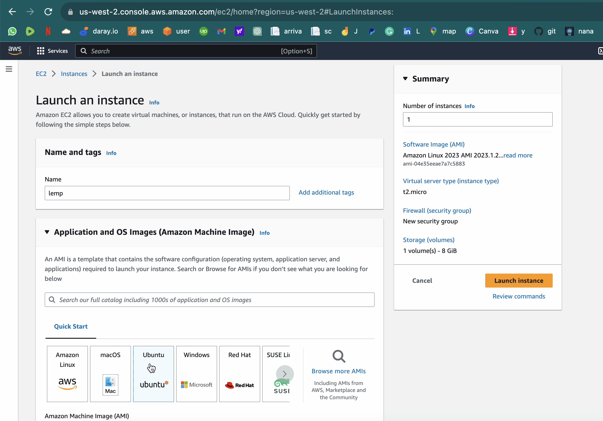

Instance Created!

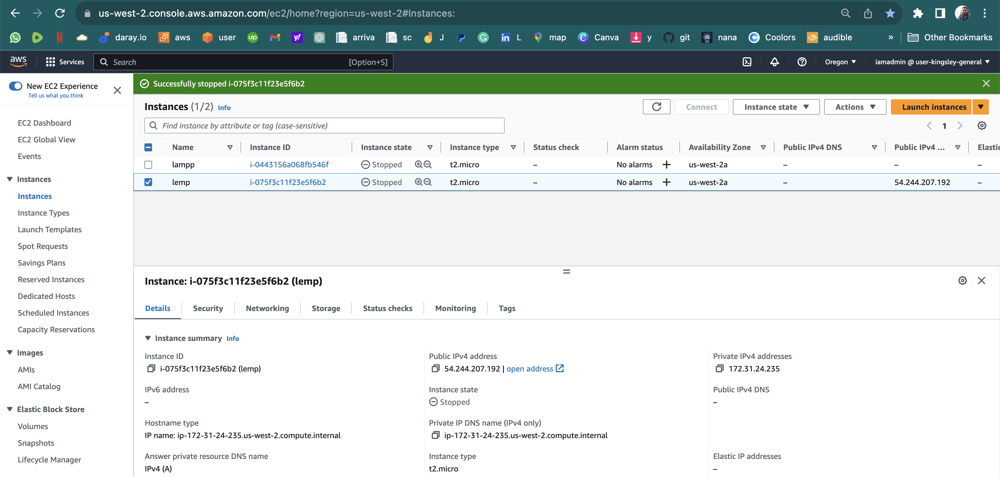

---

---

Step 2: Connect to Ubuntu Instance using Instance Connect.

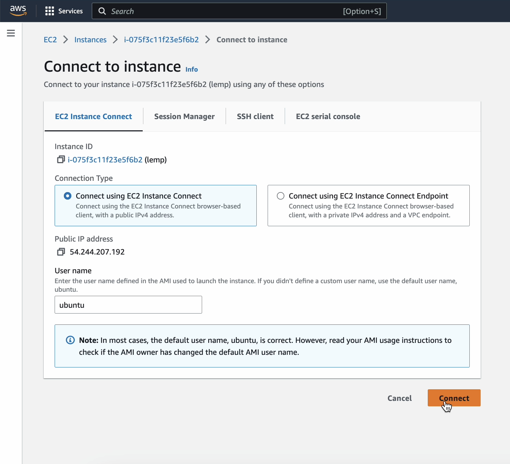

Connection Successful!

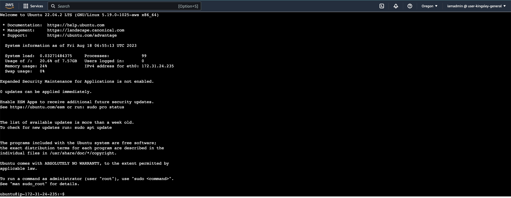

---

---

## B. **Install Nginx**

---

---

Step 3: Update the package repository by running `sudo apt update`

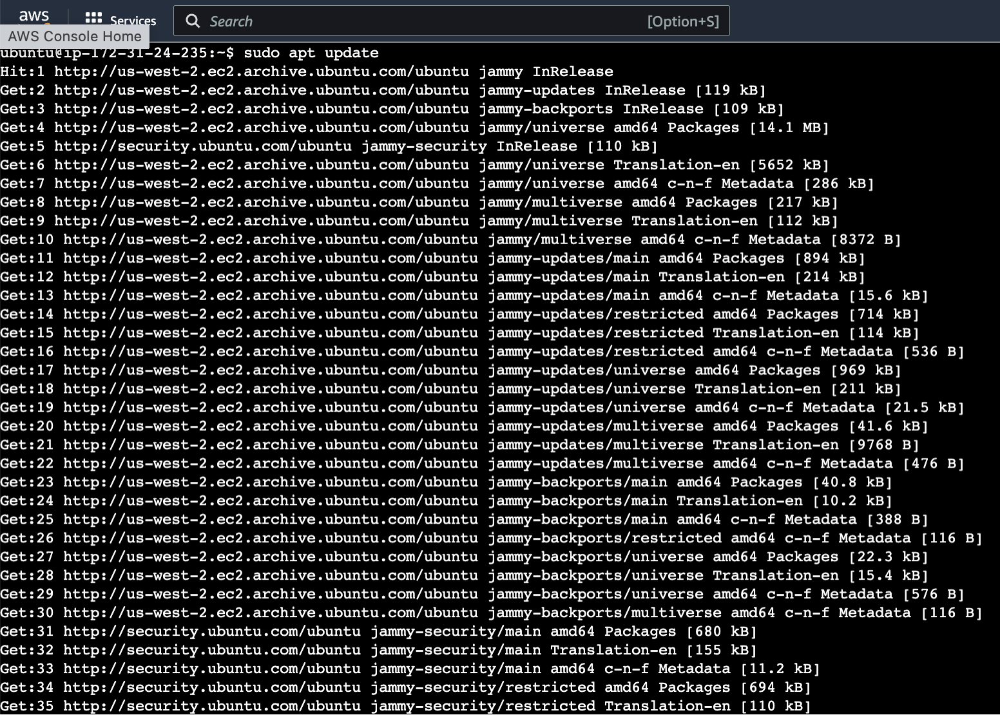

---

---

Step 4: Install Nginx by running `sudo apt install nginx`

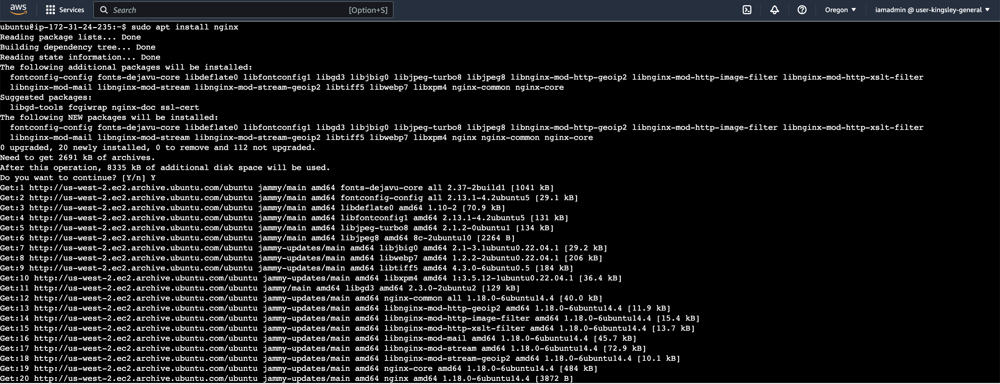

---

---

Step 5: Verify Nginx is running by running `sudo systemctl status nginx`.
If you see a green colored "active(running)", Nginx successfully installed and started on port 80!.


---

---

Step 6: Open a web browser of your choice (Chrome recommended), navigate to `http://Public-IP-Address-of-ec2:80`

If you see the page below then your web server is correctly installed and accessible through the firewall.

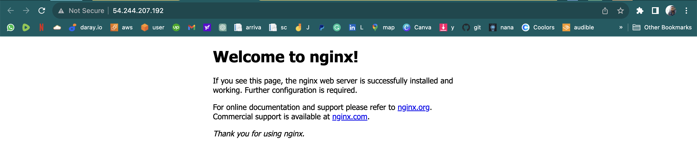

---

---

## C. **Install MYSQL**

---

---

Step 7: Use apt to install mysql-server by running `sudo apt install mysql-server`

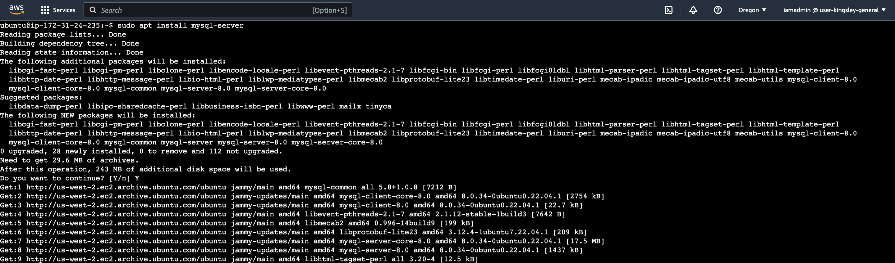

---

---


Step 8: Log in to mysql console by running `sudo mysql`

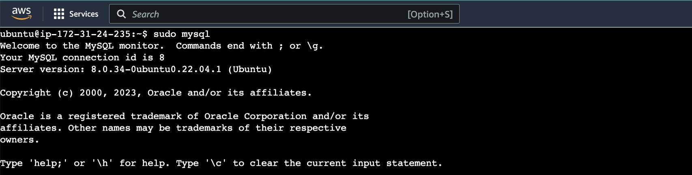

---

---

Step 9: Set password for mysql root user by running `ALTER USER 'root'@'localhost' IDENTIFIED WITH mysql_native_password BY 'PassWord.1';` and exit mysql shell by running `exit`

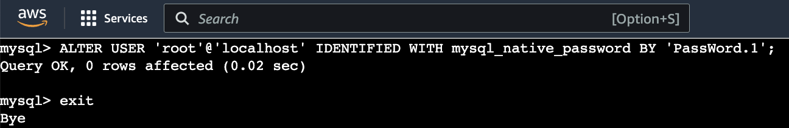

---

---

Step 10: Run the MySQL secure installation script to improve security `sudo mysql_secure_installation`

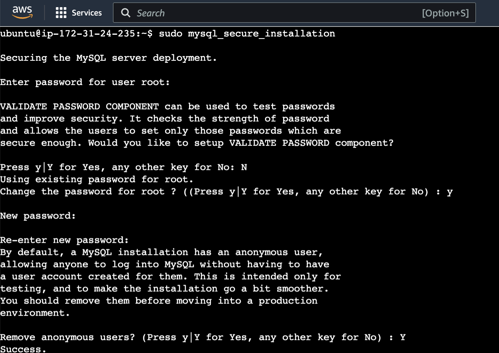

---

---

Step 11: Exit mysql shell by running `exit`

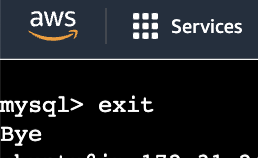

---

---

## D. **Install PHP**

---

---

Step 12: Install PHP and required modules by running `sudo apt install php libapache2-mod-php php-mysql`

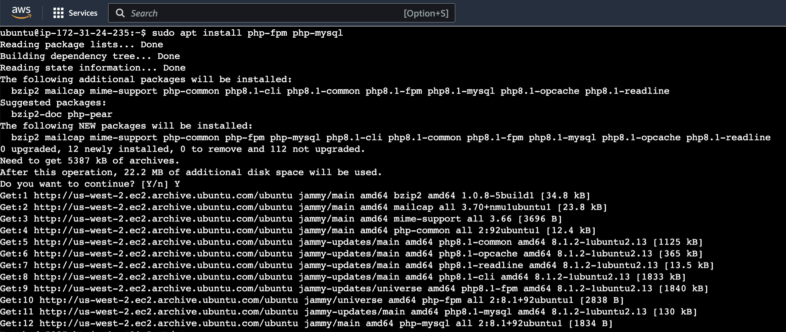

---

---

Step 13: Confirm your php version by running `php -v`

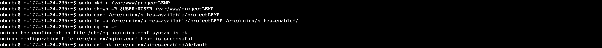

---

---

## E. **Enabling php on the website**

---

---

Step 14: To edit the dir.conf file and change the order in which the index.php file is listed, run `sudo nano /etc/apache2/mods-enabled/dir.conf` 


---

---

Step 15: Replace the code you find in dir.conf with this:

```apache
<IfModule mod_dir.c>
    # Change this:
    # DirectoryIndex index.html index.cgi index.pl index.php index.xhtml index.htm
    # To this:
    DirectoryIndex index.php index.html index.cgi index.pl index.xhtml index.htm
</IfModule>
```
Save and exit the nano editor

---

---

Step 17: Reload apache so that the changes can take effect by running `sudo systemctl reload apache2`

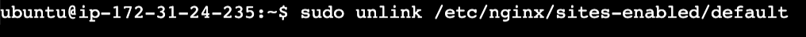

---

---

Step 18: Create and open a new file inside root your folder by running `sudo nano /var/www/projectlamp/index.php`


---

---

Step 19: Paste the following php code in the blank file

```php
<?php
phpinfo();
?> 
```
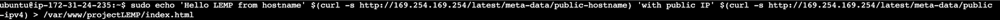
---

---

Step 20: Open it in browser using `http://localhost/index.php` or `http://yourserveripaddress/test.php` depending on what you have. Should see the image below:
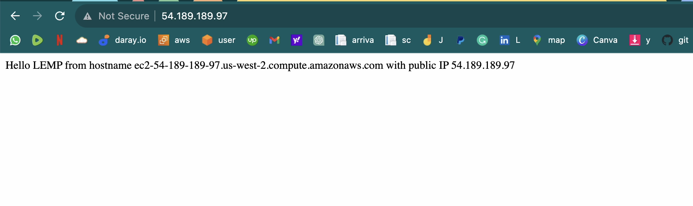

---

---

Step 22: For security reasons remove the index.php file by running `sudo rm /var/www/projectlamp/index.php`

---

---

# Congratulations! You have successfully installed Apache, MySql and php on your server.

---

---


