# **Web Stack Implementation (LEMP Stack)**

## **What is a LEMP Stack**

A LEMP stack is a powerful combination of software components that collectively form a robust platform for developing and hosting dynamic websites and web applications. The term "LEMP" is an acronym representing the four essential components constituting the stack: Linux, Nginx (pronounced "Engine X"), MySQL, and PHP.

## **Overview of each component of the LEMP Stack**

#### *Linux*
At the foundation of the LEMP stack lies Linux, the operating system that provides the necessary infrastructure for running the other components while efficiently managing hardware resources.

#### *Nginx*
Nginx, an open-source web server software, plays a crucial role in the LEMP stack. It listens to incoming HTTP requests from clients, processes these requests, and delivers web content—such as HTML, CSS, JavaScript—from the server to the clients' web browsers. Nginx excels in its ability to handle high levels of concurrent connections and efficiently serve static content.

#### *MySQL*
MySQL, an open-source relational database management system (RDBMS), is pivotal in the LEMP stack. It facilitates the management and storage of structured data, serving as the repository for data used by web applications. MySQL enables the creation of dynamic websites by enabling interactions with databases, thus supporting data-driven web applications.

#### *PHP*
PHP, a versatile scripting language, is a cornerstone in the LEMP stack. This language is predominantly used for developing dynamic web content and applications. Within the context of the LEMP stack, PHP scripts are embedded within HTML and executed on the server side. These scripts generate dynamic content, which is subsequently transmitted to clients' browsers as HTML. This functionality empowers the creation of interactive and data-driven web applications.

# **The steps in our implementation process include**
### a. Setting up and Connecting to an Ubuntu Virtual Machine

### b. Installing Nginx

### c. Installing MySQL

### d. Installing PHP

### e. Configuring Nginx to use PHP Processor

### f. Testing PHP with Nginx

### g. Retrieving data from MySQL database with PHP

By following these steps, you'll successfully implement a LEMP stack, creating a robust environment to develop and host dynamic web applications.

---

---

# A. **Setting up and Connecting to an Ubuntu Virtual Machine**

---

---

Step 1: Log in to aws and create an ubuntu ec2 instance. 


Instance Created!

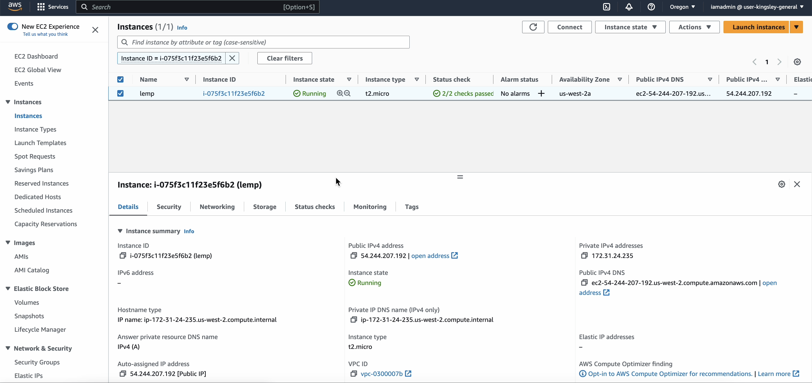

---

---

Step 2: Connect to Ubuntu Instance using Instance Connect.


Connection Successful!


---

---

# B. **Install Nginx**

---

---

Step 3: Update the package repository by running `sudo apt update`


---

---

Step 4: Install Nginx by running `sudo apt install nginx`


---

---

Step 5: Verify Nginx is running by running `sudo systemctl status nginx`.
If you see a green colored "active(running)", Nginx successfully installed and started on port 80!.

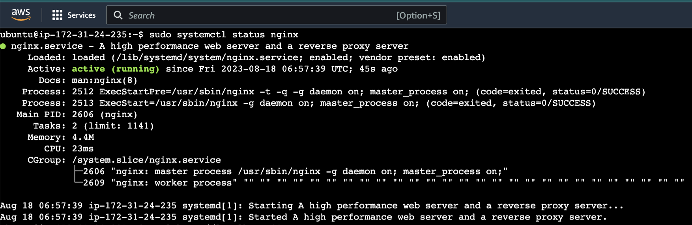

---

---

Step 6: Open a web browser of your choice (Chrome recommended), navigate to `http://Public-IP-Address-of-ec2:80`

If you see the page below then your web server is correctly installed and accessible through the firewall.


---

---

# C. **Install MYSQL**

---

---

Step 7: Use apt to install mysql-server by running `sudo apt install mysql-server`


---

---


Step 8: Log in to mysql console by running `sudo mysql`


---

---

Step 9: Set password for mysql root user by running `ALTER USER 'root'@'localhost' IDENTIFIED WITH mysql_native_password BY 'PassWord.1';` and exit mysql shell by running `exit`


---

---

Step 10: Improve security by running `sudo mysql_secure_installation`. Answer 'Y' when prompted for each question.


---

---

Step 11: Exit mysql shell by running `exit`

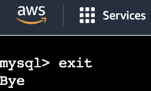

---

---

# D. **Install PHP**

---

---

Step 12: Install PHP and required modules by running `sudo apt install php-fpm php-mysql`. Answer 'Y' when prompted for a question.


---

---

# E. **Configuring Nginx to use PHP Processor**

---

---

Step 13: Create a root web directory for my website by running `sudo mkdir /var/www/projectLEMP`<br>
Step 14: Assign ownership of the directory to current user by running `sudo chown -R $USER:$USER /var/www/projectLEMP`<br>
Step 15: Open a new Configuration file in Nginx's sites-enabled directory by running `sudo nano /etc/nginx/sites-available/projectLEMP` <br>

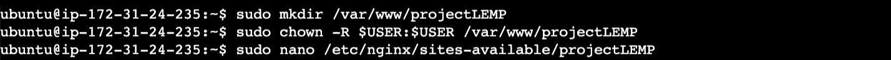

and paste the code below in the opened file.

```nginx
# /etc/nginx/sites-available/projectLEMP

# Define configuration for the virtual server
server {
    listen 80;  # Listen for incoming HTTP requests on port 80
    server_name projectLEMP www.projectLEMP;  # Handle requests for these domain names
    root /var/www/projectLEMP;  # Set the root directory for serving website files

    index index.html index.htm index.php;  # Define index file order for directory requests

    # Handle requests to the root directory ("/")
    location / {
        try_files $uri $uri/ =404;  # Try serving files, if not found, return a 404 error
    }

    # Handle requests for PHP files
    location ~ \.php$ {
        include snippets/fastcgi-php.conf;  # Include configuration for FastCGI processing
        fastcgi_pass unix:/var/run/php/php8.1-fpm.sock;  # Pass PHP requests to PHP-FPM
    }

    # Deny access to files or directories starting with ".ht"
    location ~ /\.ht {
        deny all;  # Deny access to prevent sensitive files from being accessed
    }
}
```
Save and exit the nano editor with Ctrl + X, then press Y followed by Enter to save your changes. 

---

---

Step 16: Activate your configuration by linking to the config file from Nginx's sites-enabled directory by running <br> 
`sudo ln -s /etc/nginx/sites-available/projectLEMP /etc/nginx/sites-enabled/`<br>
This will tell Nginx to use the configuration next time it is reloaded.<br>

Step 17: Test your configuration for syntax errors by typing `sudo nginx -t`
You should see:<br>
`nginx: the configuration file /etc/nginx/nginx.conf syntax is ok`<br>
`nginx: configuration file /etc/nginx/nginx.conf test is successful`<br>

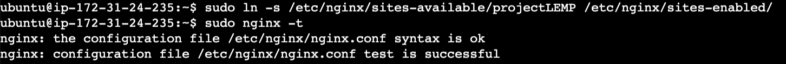

If any errors are reported, go back to your configuration file to review its contents before continuing.

---

---

Step 18: Disable default Nginx host that is currently configured to listen on port 80by running: <br> 
`sudo unlink /etc/nginx/sites-enabled/default`<br>


---

---

Step 19: Reload Nginx to apply the changes bby running <br>
`sudo systemctl reload nginx`<br>


---

---

Step 20: The website is now active, but the web root /var/www/projectLEMP is still empty. Create an index.html file in that location to test that your new server block works as expected by running<br>
`sudo echo 'Hello LEMP from hostname' $(curl -s http://169.254.169.254/latest/meta-data/public-hostname) 'with public IP' $(curl -s http://169.254.169.254/latest/meta-data/public-ipv4) > /var/www/projectLEMP/index.html`<br>


---

---

Step 21: Try to open your website URL on your browser using by running: <br> 
http://Public-IP-Address:80
or http://localhost:80 (if you're working locally)<br><br>


If you see the text from 'echo' command you wrote to index.html file, then it means your Nginx site is working as expected. In the output you will see your server's public hostname (DNS name) and public IP address.

### Congratulations, your LEMP stack is now fully configured.

---

---

# F. **Testing PHP with Nginx**

---

---

Step 22: To test if Nginx can correctly hand .php files to your PHP processor, create a test PHP file in your document root called index.php by running:<br> `nano /var/www/projectLEMP/info.php`


and paste the code below in the opened file:

```php
<?php
phpinfo();
```

---

---

Step 23: You can now access this page in your web browser by visiting the domain name or public IP address you've set up in your Nginx configuration file, followed by "/info. php". <br> 
`http://'server_domain_or_IP'/info.php`

You will see a web page containing detailed information about your server:

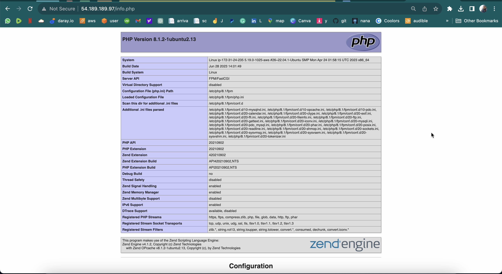

---

---

Step 24: After checking the relevant information about your PH server through that page, it's best to remove the file you created as it contains sensitive information about your PHP environment and your Ubuntu server. You can use rm to remove that fileby running <br> 
`sudo rm /var/www/your_domain/info.php`


You can always regenerate this file if you need it later.

---

---

# G. **Retrieving data from MySQL database with PHP**

---

---

Step 25: Connect to the MySQL console using the root account by running `sudo mysql -u root -p`

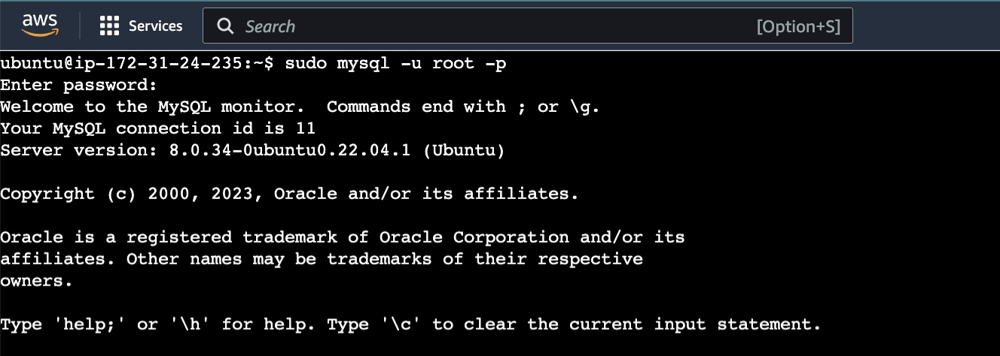

---

---

Step 26: Create a new database by running "CREATE DATABASE `example_database`;"

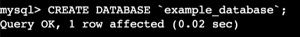

---

---

Step 27: Create a new user and grant him full privileges on the database you have just created and exit the MYSQL shell by running<br> `CREATE USER 'example_user'@'%' IDENTIFIED WITH mysql_native_password BY 'PassWord.1';`<br>
`GRANT ALL ON example_database.* TO 'example_user'@'%';`<br>
`exit`

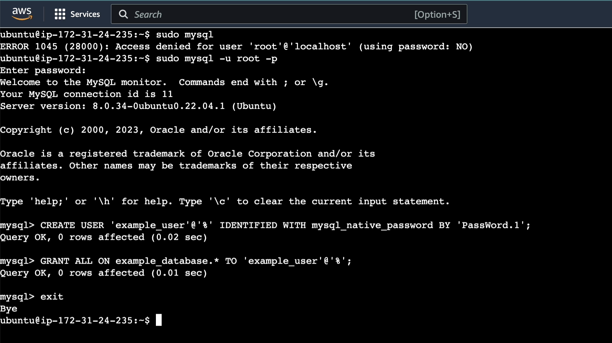

---

---

Step 28: Test if the new user has the proper permissions by logging in to the MySQL console again, this time using the custom user credentials by running: `mysql -u example_user -p`

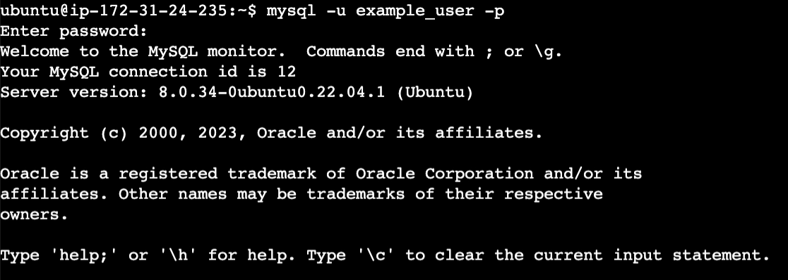

Notice the -p flag in this command, which will prompt you for the password used when creating the example_user user. 

---

---

Step 29: After logging in to the MySQL console, confirm that you have access to the example_database database by running <br>
`SHOW DATABASE;`<br>
This will give you the following output:

```
Output
+--------------------+
| Database           |
+--------------------+
| example_database   |
| information_schema |
+--------------------+
2 rows in set (0.000 sec)
```

---

---

Step 30: Create a test table named todo_list by running `CREATE TABLE example_database.todo_list (item_id INT AUTO_INCREMENT,content VARCHAR(255),PRIMARY KEY(item_id));` on the MYSQL console

Step 31: Insert a few rows of content in the test table. e.g.<br>
`INSERT INTO example_database.todo_list (content) VALUES ("My first important item");`<br>
`INSERT INTO example_database.todo_list (content) VALUES ("My second important item");`<br>
`INSERT INTO example_database.todo_list (content) VALUES ("My third important item");`<br>
`INSERT INTO example_database.todo_list (content) VALUES ("My fourth important item");`<br>
`INSERT INTO example_database.todo_list (content) VALUES ("My fifth important item");`<br>

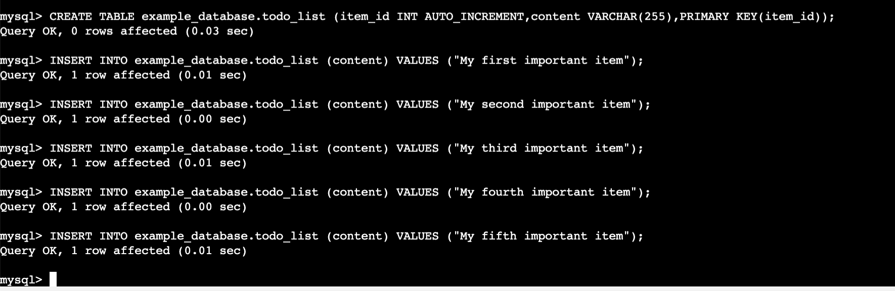

---

---

Step 32: Create a new database by running `CREATE DATABASE 'example_database`

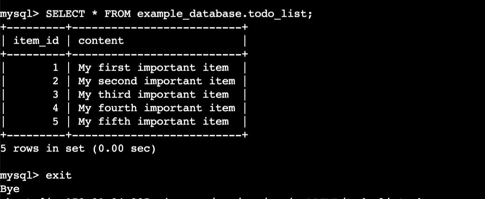

---

---

Step 33: Create a new database by running `CREATE DATABASE 'example_database`

```php
<?php
phpinfo();
?> 
```


---

---

Step 33: Create a new database by running `CREATE DATABASE 'example_database`


---

---


---

---
# Congratulations! You have successfully installed Nginx, MySql and php on your server.

---

---


